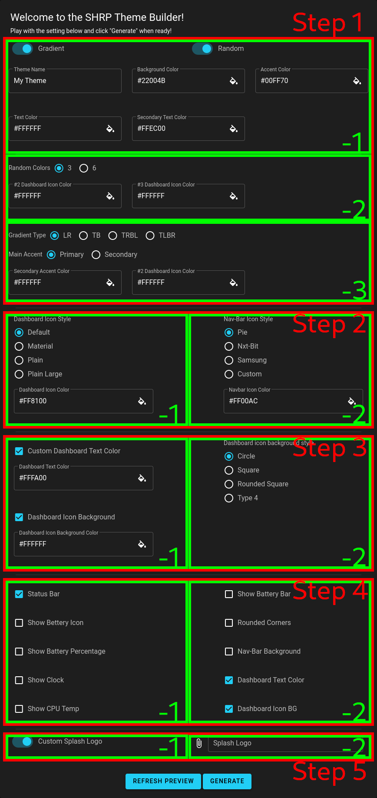

<p align="center">
    
</p>

# shrp-theme-builder

Pre-install:

- nodejs 15+
- [yarn](https://yarnpkg.com/getting-started/install)

```bash

# Install dependencies
$ yarn install

# Running it locally
$ yarn dev

# Auto fixing simple eslint warns/errors
$ yarn lint:fix

# Analyze build size
$ yarn analyze

# Generate static build
$ yarn generate

```

Folder Structure:

- assets/ - Local assets that are being used by pages and componenets (incl. json data, helper methods)
- components/ - Components used by pages (incl. Formm Logo)
- layout/ - Page layouts (incl. Default, error)
- pages/ - Pages accessible through SPA (incl. Index)
- static/ - Static files that get copied after generate is done (incl. assets, logo)

Form Structure:



Form is split into components (Steps) that are also split into sub-components (sub-steps). The Form response is handled in store using Vuex, so components don't need to directly communitacte with each other.
